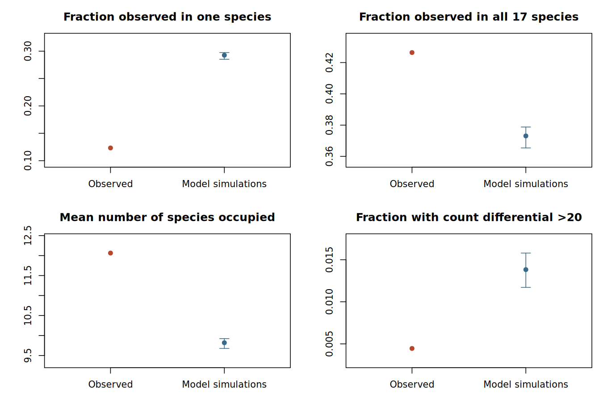

# N0 / 17-species manuscript comparison

The innovation extension fits all observed N0 families together, but this empirical model fails substantial predictive checks. Its significant HOG sets should therefore **not replace the manuscript results as validated biological conclusions**. Both branch statistics are reported because they test different aspects of reconstructed change. The marginal-MAP transition statistic is experimental and must not be interpreted alone as evidence for a directional change.

## Completed analysis

The analysis includes 12,577 families and 24 complete simulated-dataset refits (301,848 simulated families). All five parameters were re-estimated in each dataset. The first two refits audit exact-zero parameter faces; later refits use the documented interior shortcut with boundary fallback. Every replicate passed convergence and count-cap checks. Monte Carlo intervals use datasets as independent clusters.

The tree is exactly the archived manuscript 17-tip tree. All 11,025 originally prepared family count rows agree exactly. The input now also includes 1,550 single-species families and two formerly omitted multispecies families. All 56 families with count differential >20 and all 3,608 families with root MAP zero are retained. Maximum observed count: 141.

Public inputs: [dated tree](https://github.com/tomwenseleers/evodevo_waspcastes/blob/main/input_CAFE/tree_dating/Vespidae_with_outgroups_dated_primary.nwk), [archived N0 membership table](https://github.com/tomwenseleers/evodevo_waspcastes/blob/main/nextflow_runs/2_EXCON/3_EXCON_CAFE_run/results_EXCON/cafe/base/N0.tsv), and [the 22 manuscript focal events](https://github.com/tomwenseleers/evodevo_waspcastes/blob/main/output/focal_node_significant_changes_annotated.tsv). The file hashes in this report identify the exact analysed snapshots.

Equal per-copy duplication and loss are retained: q(n,n+1)=lambda*g*n+nu and q(n,n-1)=lambda*g*n. Six equiprobable gamma categories affect lambda only; innovation nu is global. A zero-inclusive Poisson root mean and symmetric one-copy error epsilon are estimated. The likelihood conditions on the family being observed in at least one tip. Innovation permits re-entry into an existing HOG from zero; it does not estimate the number of entirely unobserved HOG identities or distinguish all biological mechanisms that can yield an apparent gain.

| Parameter | Estimate |
|---|---:|
| lambda | 0.0143425552 |
| nu | 0.000307814124 |
| alpha | 0.0670145103 |
| epsilon | 0.0188503869 |
| root_mean | 0.540752621 |

Rates are per tree time unit; lambda is per existing copy, nu per family. At a positive true count, epsilon applies to each one-copy error direction. Conditional negative log likelihood: 103063.841816. Independent-start NLL minus primary NLL: 2.02854e-08. The latent cap is independently doubled from 180 to 360; the accompanying `state_space_check.json` records reconstruction and score differences.

## Requested significance comparison

Calls use raw family p<0.05 and branch p<0.01 plus nonzero inferred direction. Counts below exclude TE-associated HOGs for comparison with the manuscript; TE families remain in every model fit and in the all-family tables. The manuscript branch quantity is a Viterbi probability, whereas the new values are simulated population-model tail probabilities. The numerical cutoffs are the same, but the tests are not equivalent.

| Branch | Manuscript exp / con | Transition test exp / con | Mean-change test exp / con | Same-direction manuscript events recovered: transition / mean |
|---|---:|---:|---:|---:|
| Social Vespidae (manuscript 20) | 10 / 2 | 9 / 0 | 11 / 1 | 0 / 2 |
| Vespinae (manuscript 25) | 8 / 2 | 7 / 0 | 6 / 31 | 0 / 5 |

**Additional nominal branch cutoff requested by the user:** family p<0.05 and branch p<0.05. These use exactly the same fitted model, simulations and p-values; only the decision cutoff changes. The manuscript column remains its original family<0.05 / branch<0.01 set, allowing us to count recovery of those 22 events.

| Branch | Transition test exp / con at branch<0.05 | Mean-change test exp / con at branch<0.05 | Same-direction manuscript events recovered: transition / mean |
|---|---:|---:|---:|
| Social Vespidae (manuscript 20) | 123 / 16 | 74 / 15 | 11 / 11 |
| Vespinae (manuscript 25) | 64 / 39 | 27 / 100 | 8 / 9 |

No FDR or other multiplicity correction determines either table. Estimating additional parameters does not automatically penalize these bootstrap p-values by subtracting degrees of freedom. It can make some observed variation less unusual under the fitted model, while parameter refitting also changes the bootstrap distribution. Effects need not all have the same sign. The different branch statistic, root likelihood, family inclusion and innovation model also change inference; this comparison cannot attribute the differences solely to parameter count.

A paired diagnostic used 4 identical simulated datasets and compared fixed-parameter scoring with complete five-parameter refitting. Among the 22 manuscript events, transition p-values moved by -0.0017292 to 0.00055653; 0 raw decisions changed at branch<0.01 and 0 at branch<0.05 (family<0.05 in both). This limited comparison suggests that reference-distribution refitting is not the main source of the discrepancies for these events. It does not compare models with different parameter counts, measure power under alternatives, or replace the 24-dataset analysis.


The transition test calibrates the surprise of a transition between marginal ancestral modes, weighting gamma categories by their posterior probabilities. The sensitivity test calibrates signed posterior mean change against the global family population. Neither is a test of literal absence of all turnover on a branch. Marginal modes need not form a likely joint ancestral state pair; the posterior direction columns are essential for interpreting transition flags.

**Directional inconsistency in the transition statistic:** all nine non-TE social-branch expansion flags at branch p<0.01 have posterior P(expansion)<0.5 and joint MAP change zero. For example, N0.HOG0010041 has transition p=0.0034882 but P(expansion)=0.019 and a 95% posterior change interval [0,0]. Separate marginal modes can form a highly improbable joint pair. Bootstrap rarity of this statistic does not turn that pair into a supported expansion. These flags are retained for audit, but the transition statistic is an experimental sensitivity analysis, not a recommended directional decision rule. The posterior-mean statistic avoids selecting such a pair; its results remain limited by the population null and model inadequacy described below.

### HOG identities and functions

**Transition test: manuscript events retained in the same direction**

None.

**Mean test: manuscript events retained in the same direction**

- Vespinae (manuscript 25): `N0.HOG0000050`, expansion; odorant receptor family; family p=0.00040083, branch p=0.0014841.
- Social Vespidae (manuscript 20): `N0.HOG0000101`, expansion; cytochrome P450 family; family p=0.00028158, branch p=0.0027561.
- Vespinae (manuscript 25): `N0.HOG0000108`, expansion; glutamate receptor ionotropic, delta-1-like / probable glutamate receptor; family p=0.0017789, branch p=0.0035644.
- Vespinae (manuscript 25): `N0.HOG0000114`, expansion; fatty acid synthase; family p=0.0040646, branch p=0.0080365.
- Social Vespidae (manuscript 20): `N0.HOG0000158`, expansion; odorant receptor family; family p=0.00016232, branch p=0.0048696.
- Vespinae (manuscript 25): `N0.HOG0000373`, contraction; Zinc knuckle; family p=0.0094842, branch p=0.0038096.
- Vespinae (manuscript 25): `N0.HOG0000742`, contraction; unannotated HOG; family p=0.024583, branch p=0.0058899.

**Transition (branch p<0.05) test: manuscript events retained in the same direction**

- Social Vespidae (manuscript 20): `N0.HOG0000028`, expansion; odorant receptor family; family p=0.0072945, branch p=0.040832.
- Vespinae (manuscript 25): `N0.HOG0000042`, expansion; odorant receptor family; family p=0.0027131, branch p=0.043641.
- Vespinae (manuscript 25): `N0.HOG0000050`, expansion; odorant receptor family; family p=0.00040083, branch p=0.027687.
- Social Vespidae (manuscript 20): `N0.HOG0000058`, expansion; farnesol dehydrogenase-like / dehydrogenase/reductase SDR family member 11-like; family p=0.0028621, branch p=0.030284.
- Social Vespidae (manuscript 20): `N0.HOG0000101`, expansion; cytochrome P450 family; family p=0.00028158, branch p=0.014963.
- Social Vespidae (manuscript 20): `N0.HOG0000103`, expansion; histone H2B-like family; family p=0.0071189, branch p=0.03103.
- Vespinae (manuscript 25): `N0.HOG0000108`, expansion; glutamate receptor ionotropic, delta-1-like / probable glutamate receptor; family p=0.0017789, branch p=0.029161.
- Vespinae (manuscript 25): `N0.HOG0000114`, expansion; fatty acid synthase; family p=0.0040646, branch p=0.038036.
- Vespinae (manuscript 25): `N0.HOG0000155`, expansion; late histone H1-like / histone H1-like; family p=0.011892, branch p=0.014191.
- Social Vespidae (manuscript 20): `N0.HOG0000158`, expansion; odorant receptor family; family p=0.00016232, branch p=0.030397.
- Vespinae (manuscript 25): `N0.HOG0000162`, expansion; elongation of very long chain fatty acids protein 1-like / elongation of very long chain fatty acids protein AAEL008004-like; family p=0.017647, branch p=0.039653.
- Social Vespidae (manuscript 20): `N0.HOG0000166`, contraction; unannotated HOG; family p=0.012293, branch p=0.040246.
- Social Vespidae (manuscript 20): `N0.HOG0000299`, expansion; glutamyl aminopeptidase-like / aminopeptidase A-like; family p=0.021877, branch p=0.024302.
- Social Vespidae (manuscript 20): `N0.HOG0000470`, expansion; carbonic anhydrase 7-like / carbonic anhydrase 1-like; family p=0.030072, branch p=0.024302.
- Vespinae (manuscript 25): `N0.HOG0000504`, expansion; antizyme inhibitor 2-like / ornithine decarboxylase-like; family p=0.0095007, branch p=0.014191.
- Social Vespidae (manuscript 20): `N0.HOG0000518`, expansion; DM4/DM12 family; family p=0.026657, branch p=0.034342.
- Social Vespidae (manuscript 20): `N0.HOG0000592`, expansion; ESCO1/2 acetyl-transferase / N-acetyltransferase activity; family p=0.0049822, branch p=0.040345.
- Social Vespidae (manuscript 20): `N0.HOG0000639`, expansion; fatty acid synthase; family p=0.0068671, branch p=0.03103.
- Vespinae (manuscript 25): `N0.HOG0000814`, expansion; estradiol 17-beta-dehydrogenase 11-like / short-chain dehydrogenase/reductase family 16C member 6; family p=0.023563, branch p=0.014191.

**Mean (branch p<0.05) test: manuscript events retained in the same direction**

- Social Vespidae (manuscript 20): `N0.HOG0000028`, expansion; odorant receptor family; family p=0.0072945, branch p=0.02032.
- Vespinae (manuscript 25): `N0.HOG0000050`, expansion; odorant receptor family; family p=0.00040083, branch p=0.0014841.
- Social Vespidae (manuscript 20): `N0.HOG0000058`, expansion; farnesol dehydrogenase-like / dehydrogenase/reductase SDR family member 11-like; family p=0.0028621, branch p=0.01704.
- Social Vespidae (manuscript 20): `N0.HOG0000101`, expansion; cytochrome P450 family; family p=0.00028158, branch p=0.0027561.
- Social Vespidae (manuscript 20): `N0.HOG0000103`, expansion; histone H2B-like family; family p=0.0071189, branch p=0.015046.
- Vespinae (manuscript 25): `N0.HOG0000108`, expansion; glutamate receptor ionotropic, delta-1-like / probable glutamate receptor; family p=0.0017789, branch p=0.0035644.
- Vespinae (manuscript 25): `N0.HOG0000114`, expansion; fatty acid synthase; family p=0.0040646, branch p=0.0080365.
- Vespinae (manuscript 25): `N0.HOG0000155`, expansion; late histone H1-like / histone H1-like; family p=0.011892, branch p=0.014847.
- Social Vespidae (manuscript 20): `N0.HOG0000158`, expansion; odorant receptor family; family p=0.00016232, branch p=0.0048696.
- Vespinae (manuscript 25): `N0.HOG0000162`, expansion; elongation of very long chain fatty acids protein 1-like / elongation of very long chain fatty acids protein AAEL008004-like; family p=0.017647, branch p=0.014052.
- Social Vespidae (manuscript 20): `N0.HOG0000166`, contraction; unannotated HOG; family p=0.012293, branch p=0.013383.
- Social Vespidae (manuscript 20): `N0.HOG0000299`, expansion; glutamyl aminopeptidase-like / aminopeptidase A-like; family p=0.021877, branch p=0.043482.
- Vespinae (manuscript 25): `N0.HOG0000373`, contraction; Zinc knuckle; family p=0.0094842, branch p=0.0038096.
- Social Vespidae (manuscript 20): `N0.HOG0000470`, expansion; carbonic anhydrase 7-like / carbonic anhydrase 1-like; family p=0.030072, branch p=0.026508.
- Vespinae (manuscript 25): `N0.HOG0000504`, expansion; antizyme inhibitor 2-like / ornithine decarboxylase-like; family p=0.0095007, branch p=0.012118.
- Social Vespidae (manuscript 20): `N0.HOG0000518`, expansion; DM4/DM12 family; family p=0.026657, branch p=0.045781.
- Social Vespidae (manuscript 20): `N0.HOG0000592`, expansion; ESCO1/2 acetyl-transferase / N-acetyltransferase activity; family p=0.0049822, branch p=0.019061.
- Social Vespidae (manuscript 20): `N0.HOG0000639`, expansion; fatty acid synthase; family p=0.0068671, branch p=0.013416.
- Vespinae (manuscript 25): `N0.HOG0000742`, contraction; unannotated HOG; family p=0.024583, branch p=0.0058899.
- Vespinae (manuscript 25): `N0.HOG0000814`, expansion; estradiol 17-beta-dehydrogenase 11-like / short-chain dehydrogenase/reductase family 16C member 6; family p=0.023563, branch p=0.01502.

**All non-TE transition-test flags**

| Branch / HOG | Annotation | Family p | Branch p [95% MC interval] | P(expansion) / P(contraction) | 95% posterior change interval |
|---|---|---:|---:|---:|---:|
| Vespinae (manuscript 25) / `N0.HOG0009102` | fatty acid synthase | 0.02023 | 0.00031802 [0.00022947, 0.00040656] | 0.745 / 0.163 | [-4, 8] |
| Social Vespidae (manuscript 20) / `N0.HOG0009308` | unannotated HOG | 0.042326 | 0.0014476 [0.0011027, 0.0017926] | 0.261 / 0.008 | [0, 1] |
| Vespinae (manuscript 25) / `N0.HOG0009323` | A disintegrin and metalloproteinase with thrombospondin motifs 12-like | 0.043933 | 0.0015205 [0.0013677, 0.0016733] | 0.644 / 0.217 | [-5, 5] |
| Social Vespidae (manuscript 20) / `N0.HOG0009328` | uncharacterized LOC127070992 | 0.044678 | 0.0017358 [0.0012832, 0.0021885] | 0.311 / 0.007 | [0, 1] |
| Social Vespidae (manuscript 20) / `N0.HOG0009472` | CG13442 | 0.028078 | 0.00097061 [0.00085994, 0.0010813] | 0.412 / 0.184 | [-4, 6] |
| Vespinae (manuscript 25) / `N0.HOG0009534` | phospholipid-transporting ATPase ABCA3-like | 0.017799 | 0.00057972 [0.00046155, 0.00069788] | 0.691 / 0.197 | [-4, 7] |
| Vespinae (manuscript 25) / `N0.HOG0009958` | unannotated HOG | 0.041382 | 0.0016066 [0.0014425, 0.0017708] | 0.163 / 0.088 | [-4, 2] |
| Vespinae (manuscript 25) / `N0.HOG0010036` | fatty acid synthase | 0.031964 | 0.00060953 [0.00048842, 0.00073064] | 0.680 / 0.206 | [-4, 6] |
| Social Vespidae (manuscript 20) / `N0.HOG0010041` | uncharacterized LOC107068594 | 0.041567 | 0.0034882 [0.0023093, 0.0046671] | 0.019 / 0.009 | [0, 0] |
| Social Vespidae (manuscript 20) / `N0.HOG0010126` | unannotated HOG | 0.038811 | 0.00071885 [0.00054925, 0.00088844] | 0.315 / 0.415 | [-7, 5] |
| Vespinae (manuscript 25) / `N0.HOG0010430` | defensin-B-like / drosomycin-like | 0.043366 | 0.0015603 [0.0014089, 0.0017116] | 0.514 / 0.155 | [-4, 4] |
| Social Vespidae (manuscript 20) / `N0.HOG0010446` | MATH and LRR domain-containing protein PFE0570w-like | 0.038308 | 0.0010468 [0.00091411, 0.0011795] | 0.267 / 0.022 | [0, 1] |
| Social Vespidae (manuscript 20) / `N0.HOG0011679` | unannotated HOG | 0.038821 | 0.0024447 [0.0015973, 0.0032922] | 0.240 / 0.004 | [0, 1] |
| Social Vespidae (manuscript 20) / `N0.HOG0011681` | protein PFC0760c-like | 0.023252 | 0.0010004 [0.00088934, 0.0011115] | 0.317 / 0.075 | [-3, 5] |
| Social Vespidae (manuscript 20) / `N0.HOG0011682` | unannotated HOG | 0.034988 | 0.0010137 [0.000902, 0.0011253] | 0.246 / 0.035 | [-1, 3] |
| Vespinae (manuscript 25) / `N0.HOG0012063` | SUN domain-containing protein 2-like | 0.040405 | 0.0020903 [0.0017647, 0.0024159] | 0.203 / 0.021 | [0, 1] |

Posterior probabilities and intervals condition on the fitted parameters. They are not p-values and do not include parameter uncertainty. Annotation correspondence is descriptive; no new GO enrichment claim is made. All 22 manuscript events, including those failing either new threshold, are in [the paired comparison](manuscript_22_events_both_tests.tsv). Each statistic has a complete selected-HOG table with direct annotation evidence, TE flags, Monte Carlo intervals, multiplicity adjustments, and joint-posterior diagnostics.

Selected tables: [transition, branch<0.01](transition_selected_with_posterior.tsv); [transition, branch<0.05](transition_p05_selected_with_posterior.tsv); [mean change, branch<0.01](mean_selected_with_posterior.tsv); [mean change, branch<0.05](mean_p05_selected_with_posterior.tsv). These tables retain TE-associated calls with explicit flags; the count summaries above exclude those flags to match the manuscript interpretation policy.

[All focal tests with annotations](all_focal_tests_annotated.tsv.gz) are also available as a compressed TSV, including nonsignificant families. For example, the requested nominal transition-test rule can be reproduced in R:

```r
d <- read.delim(gzfile("all_focal_tests_annotated.tsv.gz"), check.names=FALSE)
selected <- subset(d, family_p < 0.05 & branch_p < 0.05 & MAP_change != 0)
selected_nonTE <- subset(selected, !as.logical(TE_related))
table(selected_nonTE$manuscript_node, selected_nonTE$direction)
```

## Model adequacy limits the biological inference

| Diagnostic | Observed | Simulated dataset mean | Simulated 2.5–97.5 percentiles |
|---|---:|---:|---:|
| mean_count | 0.827645 | 0.941964 | 0.920409–0.96263 |
| mean_species_present | 12.0629 | 9.81955 | 9.67711–9.92269 |
| single_species_fraction | 0.123241 | 0.292538 | 0.285114–0.2974 |
| all_species_present_fraction | 0.426413 | 0.373069 | 0.365377–0.378771 |
| max_count | 141 | 98 | 75.6–128.4 |
| differential_gt20_fraction | 0.00445257 | 0.0138248 | 0.0117119–0.0157947 |



[Exportable predictive-check figure](predictive_checks.pdf).


The fitted population generates too many single-species families and too few widely distributed families. Refitting simulated datasets calibrates the procedure under that population model; it cannot repair its mismatch to the real data. A more flexible root distribution and observation/ascertainment model are candidates for subsequent model development, evaluated by predictive performance rather than recovery of a desired HOG list. Equal birth/death rates remain a simplifying restriction. The present analysis therefore establishes computational feasibility and an auditable comparison, not a validated replacement biological analysis.

A specific ascertainment limitation is visible in the input itself. The N0 HOGs were constructed across 72 species: only one of 24,502 source HOGs contains exactly one gene globally. All 769 retained HOGs with exactly one copy in the 17 focal tips have members outside those tips. Thus the observation rule is not simply "any gene observed in these 17 species". If A denotes inclusion by the full HOG-construction process, the intended sampling law is Pr(Y17=y | A, Y17 is nonzero), whereas the present correction only conditions on the second event. This may contribute to the occupancy mismatch; it is not proof of its sole cause, nor a complete characterization of OrthoFinder inclusion rules. A future correction needs an explicit model of A or appropriate full-tree sensitivity analyses.

The root/error interaction provides another concrete diagnostic. Under the fitted N0 model, Pr(all true tip counts zero)=0.50633 and Pr(any observed copy)=0.63261. With independent zero-to-one error epsilon=0.0188504, the fraction of observed families generated entirely by error is therefore 0.50633*[1-(1-epsilon)^17]/0.63261 = 0.22123. The model predicts 18.916% of observed families to have exactly one false copy and no true tip copies, whereas only 6.114% of the real rows contain exactly one gene in total. These are model predictions, not classifications of real HOGs as annotation errors. A fixed-parameter sensitivity setting zero-to-one error to zero gives NLL104110.150728, worse than 103063.841816. Thus disabling this error without jointly revisiting the fit is not established as a solution; root, error and ascertainment assumptions interact.

For a subsequent analysis focused on within-Vespidae evolution, N11 with the matching 15-tip Vespidae tree is a reasonable alternative family definition. On the same 15 species, N0 gives 12,090 observed families and N11 gives 13,836; 3,886 versus 4,096 have exactly one copy in every species, and 8,122 versus 9,929 have at most one copy per species allowing absences. More single-copy families do not establish a better observation model. The supplied N11 membership has no genes outside Vespidae; its empty outgroup columns cannot be treated as biological zero counts on the 17-tip tree. This N0 analysis is retained as the direct manuscript benchmark. [OrthoFinder describes HOGs as clade-specific units](https://orthofinder.github.io/OrthoFinder/tutorials/guide-to-results/).

A bounded N11 check fits the same six-category, estimated-root/error model on its 15-tip tree from two positive-interior starts. Both converge to NLL97857.587306 (difference below 5e-7). Four replicated datasets per fit predict 30.4–31.0% single-species families versus 12.8% observed, and mean occupancy 8.43–8.52 versus 10.36 observed. At the slightly better fit, exactly one copy in every species is predicted for 15.1% of families versus 29.6% observed. Thus N11 gives a different biological resolution but does not remove the current predictive mismatch. This check is exploratory: it has no full boundary audit or new N11 branch bootstrap. Raw likelihoods and AIC cannot rank N0 against N11 because their observations and family definitions differ.

## Precision, validation and reproducibility

The 95% Monte Carlo intervals are approximate pointwise Student-t intervals over 24 independent datasets. They are not simultaneous intervals or confidence intervals for biological change. Calls whose intervals cross a decision threshold are explicitly marked. Pooling uses every exchangeable family in a dataset but does not treat them as independent parameter refits. No Gaussian approximation to the statistic tails is used.

The source passes 206 legacy tests (582 assertions), independent transition and mixture likelihood checks, root-mean recovery, and small-tree null calibration. Independent joint-posterior means agree with the C++ reconstruction within numerical precision. The small-tree calibration experiments cover limited parameter settings and do not prove universal error control. See [methods](../../focal_bootstrap_methods.md) for the exact nulls, pooling argument, optimization shortcut and numerical safeguards.

Input/result hashes, bootstrap seeds, fitted parameters and all replicate diagnostics are supplied in the accompanying JSON and TSV files. Full simulated datasets, logs and all-family reconstructions remain in the local validation directory; they are not copied into the source repository. This report does not change the manuscript.
